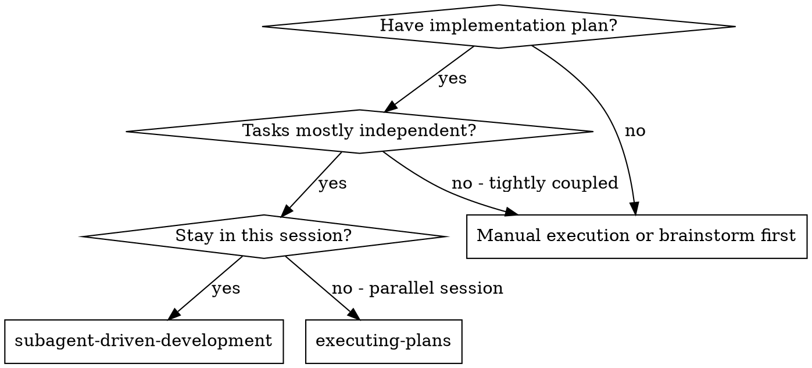
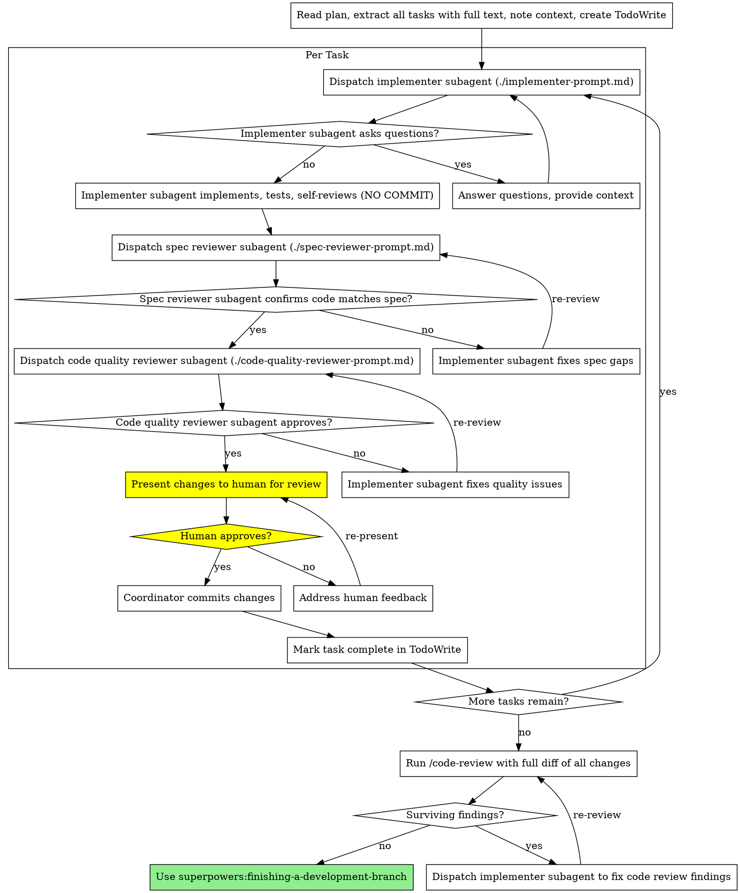

# Subagent-Driven Development

Execute plan by dispatching fresh subagent per task, with two-stage review after each: spec compliance review first, then code quality review.

**Why subagents:** You delegate tasks to specialized agents with isolated context. By precisely crafting their instructions and context, you ensure they stay focused and succeed at their task. They should never inherit your session's context or history — you construct exactly what they need. This also preserves your own context for coordination work.

**Core principle:** Fresh subagent per task + two-stage review (spec then quality) + human review gate before commit = high quality, verified iteration

**Human review workflow:** After implementer completes work and both reviews (spec + quality) pass, STOP and present the changes for human review. Only after human approval should you commit. This happens once per task before moving to the next task.

**For throwaway/prototype work:** If the code won't be peer-reviewed or go to production (personal tools, prototypes, throwaway exploratory code), see **superpowers:prototype-driven-development** — same workflow without the human gates.

## When to Use



**vs. Executing Plans (parallel session):**
- Same session (no context switch)
- Fresh subagent per task (no context pollution)
- Two-stage review after each task: spec compliance first, then code quality
- Human review gate before each commit (coordinator presents changes, human approves, coordinator commits)

## The Process



## Model Selection

Use the least powerful model that can handle each role to conserve cost and increase speed.

**Mechanical implementation tasks** (isolated functions, clear specs, 1-2 files): use a fast, cheap model. Most implementation tasks are mechanical when the plan is well-specified.

**Integration and judgment tasks** (multi-file coordination, pattern matching, debugging): use a standard model.

**Architecture, design, and review tasks**: use the most capable available model.

**Task complexity signals:**
- Touches 1-2 files with a complete spec → cheap model
- Touches multiple files with integration concerns → standard model
- Requires design judgment or broad codebase understanding → most capable model

## Handling Implementer Status

Implementer subagents report one of four statuses. Handle each appropriately:

**DONE:** Proceed to spec compliance review.

**DONE_WITH_CONCERNS:** The implementer completed the work but flagged doubts. Read the concerns before proceeding. If the concerns are about correctness or scope, address them before review. If they're observations (e.g., "this file is getting large"), note them and proceed to review.

**NEEDS_CONTEXT:** The implementer needs information that wasn't provided. Provide the missing context and re-dispatch.

**BLOCKED:** The implementer cannot complete the task. Assess the blocker:
1. If it's a context problem, provide more context and re-dispatch with the same model
2. If the task requires more reasoning, re-dispatch with a more capable model
3. If the task is too large, break it into smaller pieces
4. If the plan itself is wrong, escalate to the human

**Never** ignore an escalation or force the same model to retry without changes. If the implementer said it's stuck, something needs to change.

## Prompt Templates

- `./implementer-prompt.md` - Dispatch implementer subagent
- `./spec-reviewer-prompt.md` - Dispatch spec compliance reviewer subagent
- `./code-quality-reviewer-prompt.md` - Dispatch code quality reviewer subagent

## Example Workflow

```
You: I'm using Subagent-Driven Development to execute this plan.

[Read plan file once: docs/superpowers/plans/feature-plan.md]
[Extract all 5 tasks with full text and context]
[Create TodoWrite with all tasks]

Task 1: Hook installation script

[Get Task 1 text and context (already extracted)]
[Dispatch implementation subagent with full task text + context]

Implementer: "Before I begin - should the hook be installed at user or system level?"

You: "User level (~/.config/superpowers/hooks/)"

Implementer: "Got it. Implementing now..."
[Later] Implementer:
  - Implemented install-hook command
  - Added tests, 5/5 passing
  - Self-review: Found I missed --force flag, added it
  - Ready for review (NOT committed)

[Dispatch spec compliance reviewer on uncommitted diff]
Spec reviewer: ✅ Spec compliant - all requirements met, nothing extra

[Dispatch code quality reviewer on uncommitted diff]
Code reviewer: Strengths: Good test coverage, clean. Issues: None. Approved.

You: [Present changes to human]
  Changes ready for review:
  - Modified: src/commands/install-hook.sh
  - Added: tests/install-hook.test.sh
  - All tests passing (5/5)
  - Spec compliant ✅
  - Quality approved ✅
  
  git diff --stat shows 2 files changed, 87 insertions(+)
  
  Review and approve to commit?

Task 2: Recovery modes

[Get Task 2 text and context (already extracted)]
[Dispatch implementation subagent with full task text + context]

Human: Approved. Commit it.

[Coordinator commits with message composed from task]
git commit -m "feat: add install-hook command with --force flag

Implements hook installation at user level (~/.config/superpowers/hooks/)
with optional --force flag to overwrite existing hooks.

Tested: 5/5 tests passing"

[Mark Task 1 complete]

Task 2: Recovery modes

[Get Task 2 text and context (already extracted)]
[Dispatch implementation subagent with full task text + context]

Implementer: [No questions, proceeds]
Implementer:
  - Added verify/repair modes
  - 8/8 tests passing
  - Self-review: All good
  - Ready for review (NOT committed)

[Dispatch spec compliance reviewer on uncommitted diff]
Spec reviewer: ❌ Issues:
  - Missing: Progress reporting (spec says "report every 100 items")
  - Extra: Added --json flag (not requested)

[Implementer fixes issues]
Implementer: Removed --json flag, added progress reporting

[Spec reviewer reviews again]
Spec reviewer: ✅ Spec compliant now

[Dispatch code quality reviewer on uncommitted diff]
Code reviewer: Strengths: Solid. Issues (Important): Magic number (100)

[Implementer fixes]
Implementer: Extracted PROGRESS_INTERVAL constant

[Code reviewer reviews again]
Code reviewer: ✅ Approved

You: [Present changes to human]
  Changes ready for review:
  - Modified: src/recovery.sh
  - Added: tests/recovery.test.sh
  - All tests passing (8/8)
  - Spec compliant ✅
  - Quality approved ✅
  
  Review and approve to commit?

Human: Approved. Commit it.

[Coordinator commits with message composed from task]
git commit -m "feat: add verify and repair recovery modes

Implements verify mode to check hook integrity and repair mode
to fix corrupted hooks with progress reporting every 100 items.

Tested: 8/8 tests passing"

[Mark Task 2 complete]

...

[After all 5 tasks complete, all committed after human review]
[Run /code-review with git diff of all changes since start]
Code review debate:
  Reviewer A: Found 2 issues (magic constant, missing error handling)
  Reviewer B: Challenged magic constant finding
  Rebuttal: Magic constant finding dropped, error handling confirmed
  Synthesis: 1 surviving finding - missing error handling in parser

[Present to human, get approval]
[Dispatch implementer to fix, get human review, commit]

[Re-run /code-review]
Code review debate: No surviving findings

[Use superpowers:finishing-a-development-branch]
Done!
```

## Final Code Review

After all tasks are complete (all individually reviewed and committed), run a multi-model critical code review of the entire implementation.

**Run:** `/code-review` with the full `git diff` of all changes since the plan started (use the base commit SHA captured at the start).

The `/code-review` command has its own logic, just run it as instructed and wait for the response.

**After the debate completes:**
- If there are surviving findings, present them to human, get approval to proceed
- Dispatch an implementer subagent to fix them
- Present fixes for human review
- Human approves, then commit
- Re-run `/code-review` after fixes
- Repeat until clean
- Then proceed to finishing-a-development-branch

## Advantages

**vs. Manual execution:**
- Subagents follow TDD naturally
- Fresh context per task (no confusion)
- Parallel-safe (subagents don't interfere)
- Subagent can ask questions (before AND during work)

**vs. Executing Plans:**
- Same session (no handoff)
- Human review gate ensures quality before commits
- Review checkpoints automatic

**Efficiency gains:**
- No file reading overhead (controller provides full text)
- Controller curates exactly what context is needed
- Subagent gets complete information upfront
- Questions surfaced before work begins (not after)

**Quality gates:**
- Self-review catches issues before handoff
- Two-stage per-task review: spec compliance, then code quality (both on uncommitted code)
- Human review before each commit
- Multi-model critical final code review (findings must survive cross-examination)
- Review loops ensure fixes actually work
- Spec compliance prevents over/under-building
- Code quality ensures implementation is well-built

**Cost:**
- More subagent invocations (implementer + 2 reviewers per task)
- Controller does more prep work (extracting all tasks upfront)
- Review loops add iterations
- Human review adds latency per task
- But catches issues early (cheaper than debugging later)

## Red Flags

**Never:**
- Start implementation on main/master branch without explicit user consent
- Skip reviews (spec compliance OR code quality OR human review)
- Skip the final `/code-review` (per-task reviews passing doesn't replace holistic review)
- Proceed with unfixed issues
- Commit before human review
- Dispatch multiple implementation subagents in parallel (conflicts)
- Make subagent read plan file (provide full text instead)
- Add or expand comments in a task's code blocks. The plan's code-block comments are intentionally concise; pass them through unchanged and keep rationale in the surrounding prose, not in the code.
- Skip scene-setting context (subagent needs to understand where task fits)
- Ignore subagent questions (answer before letting them proceed)
- Accept "close enough" on spec compliance (spec reviewer found issues = not done)
- Skip review loops (reviewer found issues = implementer fixes = review again)
- Let implementer self-review replace actual review (both are needed)
- **Start code quality review before spec compliance is ✅** (wrong order)
- Move to next task while either review has open issues

**If subagent asks questions:**
- Answer clearly and completely
- Provide additional context if needed
- Don't rush them into implementation

**If reviewer finds issues:**
- Implementer (same subagent) fixes them
- Reviewer reviews again
- Repeat until approved
- Don't skip the re-review

**If human feedback received:**
- Address concerns fully
- Re-present for approval
- Don't commit until approved

**If subagent fails task:**
- Dispatch fix subagent with specific instructions
- Don't try to fix manually (context pollution)

## Integration

**Required workflow skills:**
- **superpowers:writing-plans** - Creates the plan this skill executes
- **superpowers:requesting-code-review** - Code review template for reviewer subagents
- **superpowers:finishing-a-development-branch** - Complete development after all tasks

**Subagents should use:**
- **superpowers:test-driven-development** - Subagents follow TDD for each task

**Alternative workflows:**
- **superpowers:executing-plans** - Use for parallel session instead of same-session execution
- **superpowers:prototype-driven-development** - Use for throwaway/prototype work without human review gates

Base directory for this skill: file:///Users/twhitney/workspace/superpowers/calm-frost/skills/subagent-driven-development
Relative paths in this skill (e.g., scripts/, reference/) are relative to this base directory.
Note: file list is sampled.

<skill_files>
<file>/Users/twhitney/workspace/superpowers/calm-frost/skills/subagent-driven-development/code-quality-reviewer-prompt.md</file>
<file>/Users/twhitney/workspace/superpowers/calm-frost/skills/subagent-driven-development/implementer-prompt.md</file>
<file>/Users/twhitney/workspace/superpowers/calm-frost/skills/subagent-driven-development/spec-reviewer-prompt.md</file>
</skill_files>
