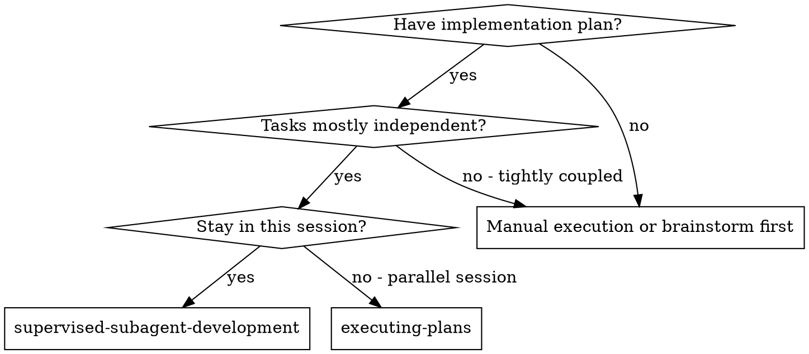
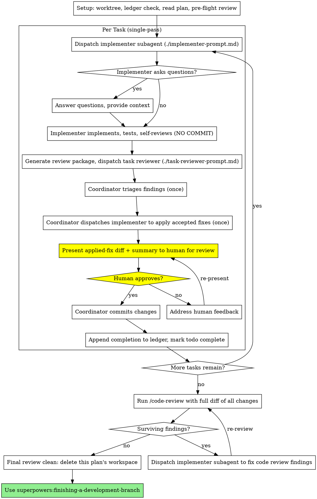

# Subagent-Driven Development

Execute plan by dispatching a fresh implementer subagent per task, a task review (spec compliance + code quality) after each, and a broad whole-branch review at the end.

**Why subagents:** You delegate tasks to specialized agents with isolated context. By precisely crafting their instructions and context, you ensure they stay focused and succeed at their task. They should never inherit your session's context or history — you construct exactly what they need. This also preserves your own context for coordination work.

**Core principle:** Fresh subagent per task + task review (spec + quality) + human review gate before commit + broad final review = high quality, verified iteration

**Narration:** between tool calls, narrate at most one short line — the
ledger and the tool results carry the record.

**Human review workflow:** After implementer completes work and both reviews (spec + quality) pass, STOP and present the changes for human review. Only after human approval should you commit. This happens once per task before moving to the next task.

**For unsupervised work:** If you do not want to approve every commit (personal tools, prototypes, throwaway exploratory code), see **superpowers:subagent-driven-development** — the autonomous workflow, with its own five-round fix loop and final review.

**Rulings, not stalls — between the gates.** The human gate is the one place
a task waits. Everywhere else, a running plan does not stall: conflicts,
ambiguities, and plan defects you meet mid-task are yours to decide. The spec
is the binding authority, the plan is its argument, and your judgment settles
what neither answers. Record each decision in the ledger as
`Ruling: <what you decided> — <why> — <what it costs if wrong>` and carry it
to the gate, where your human partner sees it with the diff.

## When to Use



**vs. Executing Plans (parallel session):**
- Same session (no context switch)
- Fresh subagent per task (no context pollution)
- Task review after each task (spec compliance + code quality + writing quality), broad review at the end
- Human review gate before each commit (coordinator presents changes, human approves, coordinator commits)

## The Process



## Setup

Ensure the work happens in an isolated workspace — create one or verify the
existing one before dispatching anything. Never start implementation on a
main/master branch without your human partner's explicit consent.

Conversation memory does not survive compaction. In real sessions,
controllers that lost their place have re-dispatched entire completed task
sequences — the single most expensive failure observed. Track progress in
a ledger file, not only in todos.

- Each plan owns a workspace: at skill start, run this skill's
  `scripts/sdd-workspace PLAN_FILE` — it prints the plan's git-ignored
  directory (`<repo-root>/.superpowers/sdd/<plan-basename>/`), home to
  every artifact for THIS plan: ledger, briefs, reports, review packages.
  Another plan's directory is never yours to read or write.
- Check for this plan's ledger at `<workspace>/progress.md`. If its first
  line names your plan file, tasks with a `Task <N>: complete` line are DONE
  — do not re-dispatch them; resume at the first task without one. A task
  without a completion line never reached its human gate: re-run its cycle
  from the review. A ledger whose first line names a different plan file —
  or a stray ledger at the old flat path `.superpowers/sdd/progress.md` — is
  another plan's progress: leave it in place and start your own, fresh.
- Create the ledger with its identity as the first line:
  `# SDD ledger — plan: <plan file path>`.
- The ledger is your recovery map: the commits it names exist in git even
  when your context no longer remembers creating them. After compaction,
  trust the ledger and `git log` over your own recollection.
- `git clean -fdx` will destroy the workspace (it's git-ignored scratch); if
  that happens, recover from `git log`.

Read the plan once, note its context and Global Constraints, and create a
todo per task. If the plan names a Spec, read that too: the spec is the
authority the plan argues from, and conflicts inside the plan resolve
against it. A plan with no reachable spec gets a ledger note saying so —
rulings made without one are provisional.

Before dispatching Task 1, scan the plan once for conflicts, writing down
what you checked as you check it:

- tasks that contradict each other or the plan's Global Constraints
- anything the plan explicitly mandates that the review rubric treats as a
  defect (a test that asserts nothing, verbatim duplication of a logic block)

The scan's output is a table, not a verdict. One row for every pair of tasks
that share a file or an interface: the two tasks, what one produces against
what the other consumes, and what you found. One row for every task: whether
its own text agrees with itself — the tests it specifies against the code it
specifies, the files it creates against the files it later touches. "The scan
is clean" without those rows is not a scan you ran.

Write the table to the ledger. Rule on everything you find before execution
begins — each finding against the plan text that mandates it — and record
each ruling in the ledger. If the scan is clean, proceed without comment.
Rule on each conflict it surfaces — the spec is the binding authority, the
plan is its argument — record the ruling beside its row, and dispatch
Task 1. The review loop remains the net for conflicts that only emerge from
implementation.

## The Per-Task Review Cycle Is Single-Pass

The task reviewer runs **once**. The coordinator triages its findings and
dispatches the implementer **once** to fix them, then the human gate
verifies. There are no per-task re-review loops.

**Scope guardrail:** single-pass applies ONLY to the per-task cycle. The
final `/code-review` (after all tasks) keeps its own multi-pass re-review
loop, and `/council` is untouched. Never remove the `Run /code-review →
Surviving findings? → fix → re-review` edges or the "Skip the final
`/code-review`" Red Flag.

### The coordinator

"The coordinator" is the main SDD orchestrator session — the top-level agent
that reads the plan, dispatches subagents, and runs `git commit`. It holds
`task` (to dispatch) and `bash`/`edit` **only to commit and orchestrate —
never to author code or fix findings**. It turns findings into fixes ONLY by
dispatching the `implementer` subagent (consistent with the existing
invariant that the coordinator delegates all code changes). Triage is a
decision, not an edit.

### Triage rule

The task reviewer returns one report carrying three kinds of finding: spec
compliance, code quality, and writing quality. Triage them together in one
pass:

- Apply all Critical and Important findings, spec and quality alike.
- Apply Minor findings too, EXCEPT a Minor is dropped only when (a) applying
  it would conflict with a Critical/Important finding, or (b) it targets
  generated or third-party code. List every dropped Minor in the human-gate
  summary as "not applied, reason: [a|b]".
- A genuinely ambiguous spec gap (the fix depends on intent the plan does
  not settle) is NOT guessed — surface it at the human gate.
- **Conflict resolution (narrow):** a conflict exists only when applying one
  finding's fix would violate another's rule (e.g. a code-quality finding
  wants a "why" comment; a writing-quality finding rejects its wording).
  Mere colocation is NOT a conflict. On a real conflict, satisfy the
  higher-severity finding and adopt the lower-severity finding's own
  supplied replacement text to reword it. The coordinator needs no STE
  knowledge — each writing-quality finding carries a compliant replacement.
- Dispatch the implementer once with the triaged, conflict-resolved list,
  then present to the human gate.

### Implementer dispatch for applying fixes

The coordinator applies fixes by dispatching the existing `implementer`
subagent via `implementer-prompt.md` — no new template. The triaged finding
list (each item: `file:line`, what to change, suggested replacement text) is
the task description. The implementer edits; it does not re-derive findings.

### Reviewer failure

SDD's implementer BLOCKED cases do not map to a read-only reviewer. Use this
instead:

- **Errored / timed-out reviewer:** re-dispatch once. If it fails again,
  surface the failure at the human gate and let your human partner decide
  whether to proceed. Do not silently skip the review.
- **Malformed output** (a finding missing `file:line`, severity, or — for a
  writing-quality finding — a replacement): treat that finding as unusable,
  list it in the human-gate summary as "could not auto-apply," and apply the
  well-formed findings normally.
- **Finding without a usable replacement:** the coordinator cannot author a
  fix (no STE knowledge), so it surfaces the finding to the human gate
  rather than dropping it silently.
- **Unreconcilable conflict:** if two Critical findings genuinely cannot
  both be satisfied, do NOT guess — present both to your human partner at
  the gate.

### Human gate presentation

Because single-pass makes the human gate the sole verification of applied
fixes, present the **actual diff of what the coordinator applied** (not just
a "spec ✅ / quality ✅" stat line), plus the fix summary (which findings
applied, which dropped and why, any items surfaced for a decision).

## Model Selection

Use the least powerful model that can handle each role to conserve cost and increase speed.

**Mechanical implementation tasks** (isolated functions, clear specs, 1-2 files): use a fast, cheap model. Most implementation tasks are mechanical when the plan is well-specified.

**Integration and judgment tasks** (multi-file coordination, pattern matching, debugging): use a standard model.

**Architecture and design tasks**: use the most capable available model.
The final whole-branch review is one of these — dispatch it on the most
capable available model, not the session default.

**Review tasks**: choose the model with the same judgment, scaled to the
diff's size, complexity, and risk. A small mechanical diff does not need the
most capable model; a subtle concurrency change does.

**Re-dispatch escalation**: when an implementer comes back BLOCKED or its
fixes miss, use a model at least one tier above the one that got stuck.

**Always specify the model explicitly when dispatching a subagent.** An
omitted model inherits your session's model — often the most capable and
most expensive — which silently defeats this section.

**Turn count beats token price.** Wall-clock and context cost scale with how
many turns a subagent takes, and the cheapest models routinely take 2-3× the
turns on multi-step work — costing more overall. Use a mid-tier model as the
floor for reviewers and for implementers working from prose descriptions.
When the task's plan text contains the complete code to write, the
implementation is transcription plus testing: use the cheapest tier for
that implementer. Single-file mechanical fixes also take the cheapest tier.

**Task complexity signals (implementation tasks):**
- Touches 1-2 files with a complete spec → cheap model
- Touches multiple files with integration concerns → standard model
- Requires design judgment or broad codebase understanding → most capable model

## The Task Loop

**Batch small same-shape work.** When the plan lists several tasks that are
each a small, independent edit of the same kind — the same one-line fix,
constant change, or field addition repeated across files — do not dispatch
one subagent per task. Compose ONE dispatch brief listing every file and
its change, send the whole batch to a single subagent, and review its diff
as one unit. Reserve one-dispatch-per-task for work that needs its own
judgment, its own tests, or its own review surface.

Everything you paste into a dispatch prompt — and everything a subagent
prints back — stays resident in your context for the rest of the session
and is re-read on every later turn. Hand artifacts over as files.

**Waiting on dispatched subagents:** never poll a wait interface with
short timeouts, and never sit in one silent, open-ended wait either.
While you have local work — ledger updates, packaging the next review,
reading reports — keep working; child results arrive on their own.
When you are genuinely idle, wait in bounded stretches (five to ten
minutes, where your platform allows), and between stretches post one
line of status and reconcile your live children: list them, and chase
any that finished without reporting. A bounded stretch keeps nearly
all of a long wait's efficiency while guaranteeing a stuck or lost
child is noticed within minutes, not at the end of the session.

### 1. Dispatch the implementer

Record BASE (`git rev-parse HEAD`) before dispatching — the per-task human
gate commits against it, and the final review package needs it.

- **Task brief:** before dispatching an implementer, run this skill's
  `scripts/task-brief PLAN_FILE N` — it extracts the task's full text to a
  uniquely named file and prints the path. Compose the dispatch so the
  brief stays the single source of
  requirements. Your dispatch should contain: (1) one line on where this
  task fits in the project; (2) the brief path, introduced as "read this
  first — it is your requirements, with the exact values to use verbatim";
  (3) interfaces and decisions from earlier tasks that the brief cannot
  know; (4) your resolution of any ambiguity you noticed in the brief;
  (5) the report-file path and report contract. Exact values (numbers,
  magic strings, signatures, test cases) appear only in the brief. Never
  make a subagent read the whole plan file.
- **Report file:** name the implementer's report file after the brief
  (brief `…/task-N-brief.md` → report `…/task-N-report.md`) and put it in
  the dispatch prompt. The implementer writes the full report there and
  returns only status, a one-line test summary, and concerns (it does not
  commit — the coordinator commits after human review).
- A dispatch prompt describes one task, not the session's history. Do not
  paste accumulated prior-task summaries ("state after Tasks 1-3") into
  later dispatches — a real session's dispatch hit 42k chars of which 99%
  was pasted history. A fresh subagent needs its task, the interfaces it
  touches, and the global constraints. Nothing else.
- The dispatch carries the no-subagents contract (it is in the
  implementer template): the implementer never dispatches subagents —
  not helpers, and never a reviewer. Review arrives from you, after the
  report. In real sessions, every reviewer a worker spawned duplicated
  the task review the controller dispatched anyway — a full extra
  review seat per task.
- If an earlier task deferred a minor finding in the area this task touches,
  carry a pointer to that ledger entry in the dispatch.
- Record the implementer's agent identity from the dispatch result — the fix
  dispatch resumes this agent, whose context is already intact.
- Never dispatch multiple implementation subagents in parallel (conflicts).

Template: [implementer-prompt.md](implementer-prompt.md)

### 2. Handle the report

Implementer subagents report one of four statuses. Handle each appropriately:

**DONE:** Generate the review package for the implementer's uncommitted work (`scripts/review-package --working-tree PLAN_FILE`, from this skill's directory — it prints the unique file path it wrote; the implementer leaves the work uncommitted, so the package covers the working-tree diff against HEAD, not a committed BASE..HEAD range), then dispatch the task reviewer with the printed path. The coordinator commits only after the review passes and the human approves.

**DONE_WITH_CONCERNS:** The implementer completed the work but flagged doubts. Read the concerns before proceeding. If the concerns are about correctness or scope, address them before review. If they're observations (e.g., "this file is getting large"), note them and proceed to review.

**NEEDS_CONTEXT:** The implementer needs information that wasn't provided. Provide the missing context and re-dispatch.

**BLOCKED:** The implementer cannot complete the task. Assess the blocker:
1. If it's a context problem, provide more context and re-dispatch with the same model
2. If the task requires more reasoning, re-dispatch with a more capable model
3. If the task is too large, break it into smaller pieces
4. If the plan itself is wrong, rule on the correction, ledger it, and re-dispatch with the ruling carried in the dispatch

**Never** ignore an escalation or force the same model to retry without changes. If the implementer said it's stuck, something needs to change.

If the implementer asks questions — before starting or mid-task — answer
clearly and completely, provide additional context if needed, and don't
rush it into implementation.

The task reviewer may report "⚠️ Cannot verify from diff" items — requirements
that live in unchanged code or span tasks. These do not block the rest of the
review, but you must resolve each one yourself before marking the task
complete: you hold the plan and cross-task context the reviewer
lacks. If you confirm an item is a real gap, fold it into the triage list as
an Important spec finding — the single fix dispatch covers it and the human
gate verifies it.

### 3. Review the task

Per-task reviews are task-scoped gates. The broad review happens once, at the
final whole-branch review. Never skip the task review, and never accept a
report missing either verdict — spec compliance AND task quality are both
required. Implementer self-review never replaces the task review; both are
needed.

- Hand the reviewer its diff as a file: run this skill's
  `scripts/review-package --working-tree PLAN_FILE` and pass the reviewer the
  file path it prints (or, without bash: `git status --short`, `git diff --stat
  HEAD`, and `git diff -U10 HEAD`, redirected to one uniquely named file).
  The per-task review runs on the implementer's UNCOMMITTED work — nothing
  is committed until the human approves — so the package diffs the working
  tree against HEAD, not a committed range. The output never enters your
  own context, and the reviewer sees the status, stat summary, and full
  diff with context in one Read call. Never dispatch a task reviewer
  without a diff file.
- **Reviewer inputs:** the task reviewer gets three paths — the same brief
  file, the report file, and the review package — plus the global
  constraints that bind the task.
- The global-constraints block you hand the reviewer is its attention
  lens. Copy the binding requirements verbatim from the plan's Global
  Constraints section or the spec: exact values, exact formats, and the
  stated relationships between components ("same layout as X", "matches
  Y"). The reviewer's template already carries the process rules (YAGNI,
  test hygiene, review method) — the constraints block is for what THIS
  project's spec demands.
- Do not add open-ended directives like "check all uses" or "run race tests
  if useful" without a concrete, task-specific reason
- Do not ask a reviewer to re-run tests the implementer already ran on the
  same code — the implementer's report carries the test evidence
- Do not pre-judge findings for the reviewer — never instruct a reviewer to
  ignore or not flag a specific issue. If you believe a finding would be a
  false positive, let the reviewer raise it and adjudicate it at triage. If
  the prompt you are writing contains "do not flag," "don't treat X as a
  defect," "at most Minor," or "the plan chose" — stop: you are pre-judging,
  usually to spare yourself a fix dispatch.

Template: [task-reviewer-prompt.md](task-reviewer-prompt.md)

### 4. Triage and fix, once

- Dispatch fix subagents for Critical and Important findings, and for the
  Minor findings the triage rule keeps. Record every dropped Minor in the
  progress ledger as you go (`Task <N>: minor (deferred): <one-liner>`), and
  point the final whole-branch review at that list so it can triage which
  must be fixed before merge. A roll-up nobody reads is a silent discard.
- A finding labeled plan-mandated — or any finding that conflicts with
  what the plan's text requires — is the human's decision, like any plan
  contradiction: present the finding and the plan text, ask which governs.
  Do not dismiss the finding because the plan mandates it, and do not
  dispatch a fix that contradicts the plan without asking.
- Every fix dispatch carries the implementer contract: the fix subagent
  re-runs the tests covering its change and reports the results. Name the
  covering test files in the dispatch — a one-line fix does not need the
  whole suite. Confirm the fix report contains the covering tests, the
  command run, and the output before you open the per-task human gate, and
  again before re-dispatching the final whole-branch reviewer.
- Never fix findings yourself in the coordinator session — your context stays
  clean for coordination, and coordinator fixes skip review.

- Fix dispatches append their fix report (with test results) to the same
  report file and return a short summary; the final review's re-reviews read
  the updated file.

### 5. The human gate

Present the **actual diff of what the coordinator applied** plus the fix
summary (which findings applied, which dropped and why, any items surfaced
for a decision, any rulings you made mid-task). Wait for approval. If your
human partner asks for changes, dispatch the implementer again and
re-present — never commit unapproved work.

### 6. Complete the task

A task is complete only after its review is clean, the human has approved,
and the coordinator has committed. At that point append the completion line
to the ledger in the same message as your other bookkeeping:

`Task <N>: complete (commit <sha7>, review clean, human approved)`

Then mark the todo complete and move on. Never move to the next task while
the review has open Critical/Important issues that are neither fixed nor
recorded as deferred minors.

## Final Code Review

After all tasks are complete (all individually reviewed, human-approved, and
committed), run a multi-model critical code review of the entire
implementation.

The final whole-branch review gets a package too: run
`scripts/review-package PLAN_FILE MERGE_BASE HEAD` (MERGE_BASE = the commit the
branch started from, e.g. `git merge-base main HEAD`) and include the
printed path in the review, so the final reviewer reads one file instead of
re-deriving the branch diff with git commands. Point it at the ledger's
deferred-minor lines so it can triage which must be fixed before merge.

**Run:** `/code-review` with that package. The `/code-review` command has its
own logic — run it as instructed and wait for the response.

**After the debate completes:**
- If there are surviving findings, present them to your human partner and get
  approval to proceed
- Dispatch ONE implementer subagent with the complete findings list — not one
  fixer per finding. Per-finding fixers each rebuild context and re-run
  suites; a real session's final-review fix wave cost more than all its tasks
  combined.
- Present the fixes for human review; commit only after approval
- Re-run `/code-review` after fixes, and repeat until clean

## Finish

When the final whole-branch review is clean and its fixes are committed,
delete this plan's workspace (`rm -rf <workspace>`) — the git history is
the record now. Sibling directories belong to other plans; leave them
alone.

Use superpowers:finishing-a-development-branch.

## Common Rationalizations

| Excuse | Reality |
|--------|---------|
| "Close enough on spec compliance" | Reviewer found spec gaps = not done. Fix them, or surface them at the human gate — those are the only exits. |
| "I'll fix it myself, dispatching is overhead" | Coordinator fixes pollute your context and skip review. Dispatch the implementer. |
| "The fix was small, commit it and tell them after" | The gate is before the commit, not after. An unapproved commit is the one thing this workflow exists to prevent. |
| "This finding is obviously wrong, I'll drop it" | Triage keeps every Critical and Important finding, and every dropped Minor is named at the gate. Silent discards are forbidden. |
| "One more review round will converge" | The per-task cycle is single-pass by design. Fix once, then let the human gate verify. |
| "Reviews slow the loop down" | The loop without reviews is just unverified churn. Reviews are the loop's brakes and steering. |
| "Ledger bookkeeping is overhead" | The ledger is what survives compaction. Coordinators without one have re-dispatched entire completed task sequences. |
| "The implementer spawned its own reviewer — free extra assurance" | It's a duplicate seat reviewing the same diff; the task review is the gate. A worker-spawned reviewer is a defect to flag, not rigor. |

## Example Workflow

```
You: I'm using Subagent-Driven Development to execute this plan.

[Setup: worktree verified]
[Read plan file once: docs/superpowers/plans/feature-plan.md]
[Resolve workspace: scripts/sdd-workspace docs/superpowers/plans/feature-plan.md — no ledger inside, fresh start]
[Create todos for all tasks]

Task 1: Hook installation script

[Run task-brief for Task 1; dispatch implementer with brief + report paths + context]

Implementer: "Before I begin - should the hook be installed at user or system level?"

You: "User level (~/.config/superpowers/hooks/)"

Implementer: [Later]
  - Implemented install-hook command
  - Added tests, 5/5 passing
  - Self-review: Found I missed --force flag, added it
  - Ready for review (NOT committed)

[Run review-package --working-tree PLAN_FILE; dispatch task reviewer with the printed path]
Task reviewer: Spec ✅ - all requirements met, nothing extra.
  Strengths: Good test coverage, clean. Issues: None. Task quality: Approved.

You: [Present changes to human]
  Changes ready for review:
  - Modified: src/commands/install-hook.sh
  - Added: tests/install-hook.test.sh
  - All tests passing (5/5)
  - Spec compliant ✅
  - Quality approved ✅

  git diff --stat shows 2 files changed, 87 insertions(+)

  Review and approve to commit?

Human: Approved. Commit it.

[Coordinator commits with message composed from task]
git commit -m "feat: add install-hook command with --force flag

Implements hook installation at user level (~/.config/superpowers/hooks/)
with optional --force flag to overwrite existing hooks.

Tested: 5/5 tests passing"

[Ledger: Task 1: complete (commit a1b2c3d, review clean, human approved)]

Task 2: Recovery modes

[Run task-brief for Task 2; dispatch implementer with brief + report paths + context]

Implementer: [No questions]
  - Added verify/repair modes
  - 8/8 tests passing
  - Self-review: All good
  - Ready for review (NOT committed)

[Run review-package --working-tree PLAN_FILE; dispatch task reviewer with the printed path]
Task reviewer: Spec ❌:
  - Missing: Progress reporting (spec says "report every 100 items")
  Issues (Important): Magic number (100)
  Issues (Minor): comment uses "should"; replacement: "Adjust the interval
    when the run is slow." (STE-7)

[Coordinator triages all three kinds of finding, dispatches implementer once]
Implementer: Removed --json flag, added progress reporting, extracted
  PROGRESS_INTERVAL constant, reworded comment.
  Re-ran test/recovery.test.js — 10/10 passing. Fix report appended.

You: [Present applied-fix diff + summary to human]
  Modified: src/recovery.sh; Added: tests/recovery.test.sh (10/10 passing)
  Applied: progress reporting restored, --json removed, PROGRESS_INTERVAL
  extracted, comment reworded (STE-7). Dropped: none.
  git diff shown below. Review and approve to commit?

Human: Approved. Commit it.

[Coordinator commits with message composed from task]
git commit -m "feat: add verify and repair recovery modes

Implements verify mode to check hook integrity and repair mode
to fix corrupted hooks with progress reporting every 100 items.

Tested: 10/10 tests passing"

[Ledger: Task 2: complete (commit b7c8d9e, review clean, human approved)]

...

[After all 5 tasks complete, all committed after human review]
[Run review-package PLAN_FILE MERGE_BASE HEAD; run /code-review with that package]
Code review debate:
  Reviewer A: Found 2 issues (magic constant, missing error handling)
  Reviewer B: Challenged magic constant finding
  Rebuttal: Magic constant finding dropped, error handling confirmed
  Synthesis: 1 surviving finding - missing error handling in parser

[Present to human, get approval]
[Dispatch implementer to fix, get human review, commit]

[Re-run /code-review]
Code review debate: No surviving findings

[Delete this plan's workspace — the record now lives in git]

Done! Using superpowers:finishing-a-development-branch.
```

## Advantages

**vs. Manual execution:**
- Subagents follow TDD naturally
- Fresh context per task (no confusion)
- Parallel-safe (subagents don't interfere)
- Subagent can ask questions (before AND during work)

**vs. Executing Plans:**
- Same session (no handoff)
- Human review gate ensures quality before commits
- Review checkpoints automatic

**Efficiency gains:**
- Controller curates exactly what context is needed; bulk artifacts move
  as files, not pasted text
- Subagent gets complete information upfront
- Questions surfaced before work begins (not after)

**Quality gates:**
- Self-review catches issues before handoff
- Task review carries three verdicts in one pass: spec compliance, code quality, and writing quality; the coordinator triages and applies fixes once before the human gate (all on uncommitted code)
- Human review before each commit
- Multi-model critical final code review (findings must survive cross-examination)
- Per-task cycle is single-pass; the human gate verifies applied fixes. The final `/code-review` re-reviews until clean.
- Spec compliance prevents over/under-building
- Code quality ensures implementation is well-built

**Cost:**
- More subagent invocations (implementer + reviewer per task)
- Controller does more prep work (extracting all tasks upfront)
- Per-task review is one reviewer dispatch plus at most one fix dispatch; single-pass removes the previously unbounded per-task re-review iterations.
- Human review adds latency per task
- But catches issues early (cheaper than debugging later)

## Red Flags

**Never:**
- Start implementation on main/master branch without explicit user consent
- Skip task review, or accept a report missing either verdict (spec compliance AND task quality are both required)
- Skip human review before commit
- Skip the final `/code-review` (per-task reviews passing doesn't replace holistic review)
- Proceed with unfixed issues
- Commit before human review
- Dispatch multiple implementation subagents in parallel (conflicts)
- Make a subagent read the whole plan file (hand it its task brief —
  `scripts/task-brief` — instead)
- Add or expand comments in a task's code blocks. The plan's code-block comments are intentionally concise; pass them through unchanged and keep rationale in the surrounding prose, not in the code.
- Skip scene-setting context (subagent needs to understand where task fits)
- Ignore subagent questions (answer before letting them proceed)
- Accept "close enough" on spec compliance (task reviewer found spec issues = not done)
- Add per-task re-review loops. The per-task review cycle is single-pass: the coordinator dispatches the implementer once to fix findings, then the human gate verifies. (This does NOT apply to the final `/code-review`, which keeps its re-review loop.)
- Let implementer self-review replace actual review (both are needed)
- Tell a reviewer what not to flag, or pre-rate a finding's severity in the
  dispatch prompt ("treat it as Minor at most") — the plan's example code is
  a starting point, not evidence that its weaknesses were chosen
- Dispatch a task reviewer without a diff file — generate it first
  (`scripts/review-package --working-tree PLAN_FILE`) and name the printed
  path in the prompt
- Let a subagent dispatch its own reviewer — review is the coordinator's
  job, and a worker-spawned reviewer duplicates it at full cost
- Read or write another plan's workspace directory (`.superpowers/sdd/<plan>/`)
- Move to next task while the review has open Critical/Important issues
- Re-dispatch a task the progress ledger already marks complete — check
  the ledger (and `git log`) after any compaction or resume

**If subagent asks questions:**
- Answer clearly and completely
- Provide additional context if needed
- Don't rush them into implementation

**If a per-task reviewer finds issues:**
- The coordinator triages, then dispatches the implementer once to apply the accepted fixes
- The human gate verifies the applied fixes (no per-task re-review)
- The final `/code-review` still re-reviews until clean — that loop is unchanged

**If human feedback received:**
- Address concerns fully
- Re-present for approval
- Don't commit until approved

**If subagent fails task:**
- Dispatch fix subagent with specific instructions
- Don't try to fix manually (context pollution)

## Integration

**Required workflow skills:**
- **superpowers:writing-plans** - Creates the plan this skill executes
- **superpowers:requesting-code-review** - Review rubric this skill's reviewers draw on
- **superpowers:finishing-a-development-branch** - Complete development after all tasks

**Subagents should use:**
- **superpowers:test-driven-development** - Subagents follow TDD for each task

**Alternative workflows:**
- **superpowers:executing-plans** - Use for parallel session instead of same-session execution
- **superpowers:subagent-driven-development** - Use for unsupervised execution without human review gates
